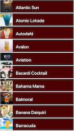
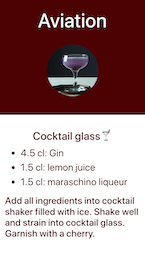
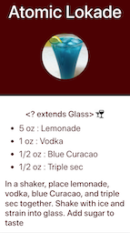
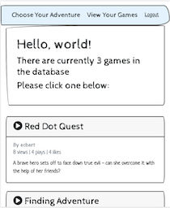
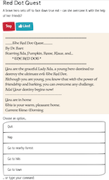
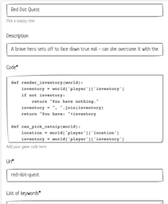
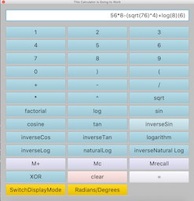
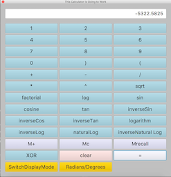
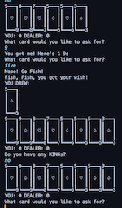
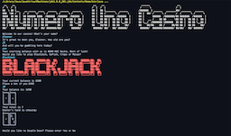

Highly motivated Software Developer with experience in data analytics and a passion for full stack development. A detail oriented professional who thrives in fast-paced, intensive, research focused environments. Excellent communicator, skilled at presenting and conveying complex, domain-specific information to team members in easy to understand terms. 

[Check out my resume](https://docs.google.com/document/d/16gB0iobGVH8CEFEHYtfQ_ZvxI0zrScuwmNG7i3dhlQE/edit?usp=sharing)

Below are some of my projects from my time at Zipcode.

## Cocktail Compendium

*(in-progress)*

A web app for searching and filtering cocktails by ingredients and calorie estimations. Uses a MySQL database connected to Spring Boot using Hibernate and a React frontend. Draws cocktails from an [external API.](https://www.thecocktaildb.com/api.php) 

[View Project Backend GitHub](https://github.com/ElBell/CocktailSpringBoot)  
[View Project Frontend GitHub](https://github.com/ElBell/CocktailReact)

## Choose Your Python Adventure
A website for hosting text-based adventure games that were written in Python. Games are playable client-side via Brython. Built in Django with a Postgres database and hosted on Heroku. 

[Visit Site](https://choose-your-python-adventure.herokuapp.com/)  
[View Project GitHub](https://github.com/ElBell/ChooseYourAdventure)

## Calculator
A scientific calculator created in Java using JavaFX for the GUI. Parses arbitrary user input via a modification of Djikstra's Shunting-yard algorithm. Respects order of operations and functions in binary, hexadecimal, octal, and decimal.

[View Project GitHub](https://github.com/ElBell/Calculator)

## Casino
A Java-based casino app that runs in the terminal. Personally responsible for overall architecture, game selection interface and the GoFish game. Served as team lead and ScrumMaster for team of 5 in completing this project.

[View Project GitHub](https://github.com/ElBell/Maven.Casino)

