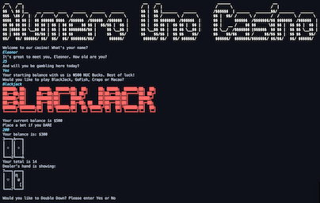

# Projects
## Casino
A Java-based casino app that runs in the terminal. Personally responsible for overall arcitecure, game selection interface and the GoFish game. Served as team lead and Scrum master for team of 5 in completing this project.

[View Project GitHub](https://github.com/ElBell/Maven.Casino)

## Calculator
A scientific calculator created in Java using JavaFX for the GUI. Respects order of operations and functions in binary, hexadecimal, octal, and decimal.

[View Project GitHub](https://github.com/ElBell/Calculator)

## Cocktail Compendium

## Corgis are great
