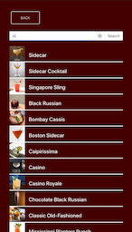
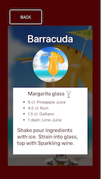

  
Eleonor Marilyn Bart, affectionately known as Ellie, peacefully departed this world on June 9, 2023, leaving behind a legacy of love, kindness, and strength. She was a beloved daughter, a doting sister, a cherished friend, and a devoted wife whose radiant spirit touched the lives of all who had the privilege of knowing her.

  
  
To honor Ellie's memory and the incredible person she was, the family kindly requests that in lieu of flowers, donations be made to a Memorial Fund that will be established in her honor. This cause will support women from non-traditional paths who are aspiring to become Software Engineers, just like Ellie. To sign up to receive more details on the fund, put your email in the form below.

    <iframe src="https://docs.google.com/forms/d/e/1FAIpQLSf_9nmILNXE3MRVjum5_JdosqDboMkHrT60MSvcA1Y4bh0kvQ/viewform?embedded=true" width="100%" height="640" frameborder="0" marginheight="0" marginwidth="0">Loading…</iframe>

Highly motivated Software Developer with a master’s degree in Animal Science, professional experience in data analytics, and a passion for full stack development. A detail-oriented professional who thrives in fast-paced, intensive, research-focused environments. Excellent communicator, skilled at presenting and conveying complex, domain-specific information to team members in easy to understand terms.  

[Check out my resume](EleonorBartResume.pdf)

Below are some of my projects from my time at Zip Code Wilmington.

## Cocktail Compendium

A web app for searching and filtering cocktails by ingredients. Uses React front end with Spring Boot connected to a MySQL database and hosted on Heroku. Draws cocktails from an [external API.](https://www.thecocktaildb.com/api.php) 

**[Visit Site](https://cocktail-compendium.herokuapp.com/)**

[View Project GitHub - React](https://github.com/ElBell/CocktailReact) 
[View Project GitHub - Spring Boot](https://github.com/ElBell/CocktailSpringBoot)  

## Choose Your Python Adventure
A website for hosting text-based adventure games that were written in Python. Games are playable client-side via Brython. Built in Django with a Postgres database and hosted on Heroku. 

**[Visit Site](https://choose-your-python-adventure.herokuapp.com/)**

[View Project GitHub](https://github.com/ElBell/ChooseYourAdventure)

## Calculator
A scientific calculator created in Java using JavaFX for the GUI. Parses arbitrary user input via a modification of Djikstra's Shunting-yard algorithm. Respects order of operations and functions in binary, hexadecimal, octal, and decimal.

[View Project GitHub](https://github.com/ElBell/Calculator)

## Casino
A Java-based casino app that runs in the terminal. Personally responsible for overall architecture, game selection interface and the GoFish game. Served as team lead and Scrum Master for team of 5 in completing this project.

[View Project GitHub](https://github.com/ElBell/Maven.Casino)

